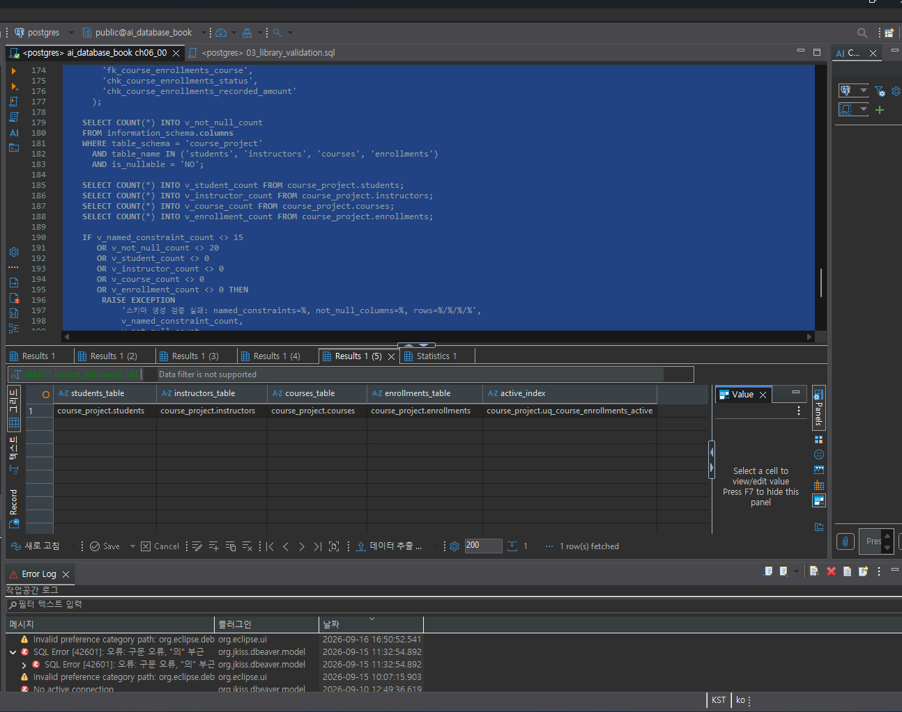
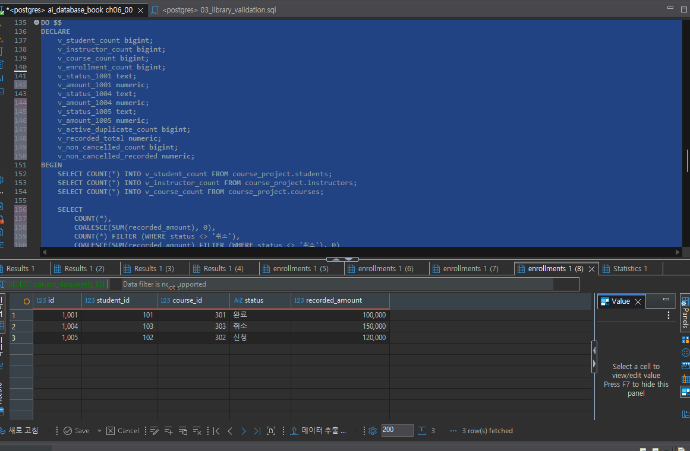
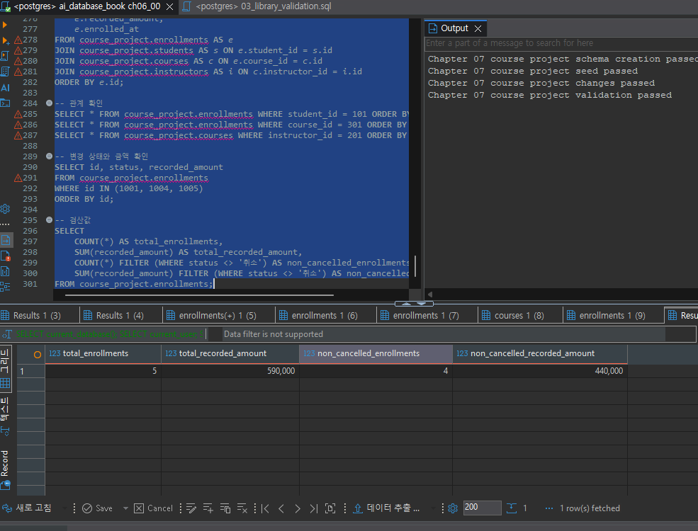
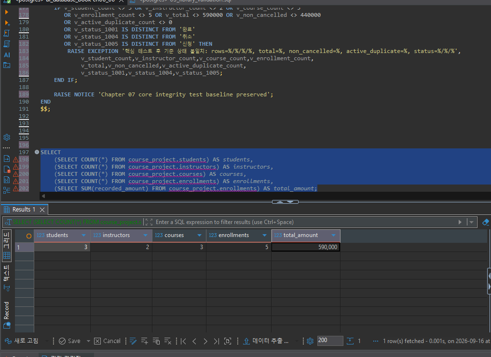
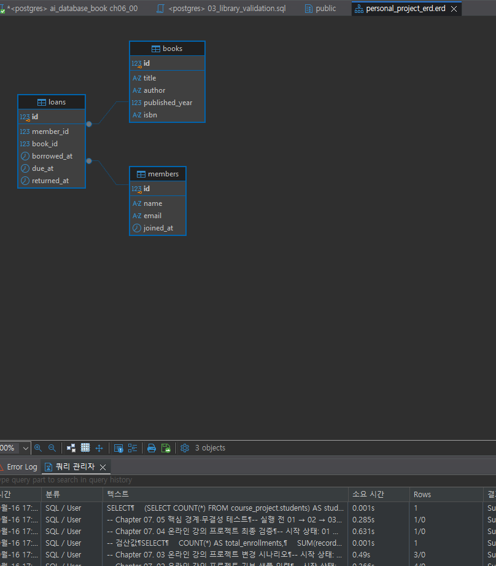

# Chapter 07 확장 실습 답안 템플릿

> **과제:** 실전 프로젝트 1 — 온라인 강의 수강신청 DB 완성하기  
> **사용 방법:** 이 파일을 내려받아 본인의 GitHub 저장소에 `chapter07_answer.md`라는 이름으로 저장한 뒤 실습하면서 바로 작성합니다.  
> **제출 방법:** LMS에는 파일을 직접 업로드하지 않고, **본인 GitHub 저장소의 `chapter07_answer.md` 파일 URL**을 제출합니다.

---

## 제출 전 주의

이 파일과 캡처 화면에는 실제 비밀번호, 전체 DB 접속 URL, API Key, 개인정보를 기록하지 않습니다.

```text
GitHub 계정 또는 별칭: kyrdufmal-summer
과제 작성일: 2026-09-15
사용한 AI 도구: ChatGPT
```

---

# 1. 시작 환경 확인

다음을 실행합니다.

```sql
SELECT current_database();
SELECT current_user;
SELECT current_schema();
SHOW search_path;
SHOW transaction_read_only;
```

| 확인 항목 | 실제 결과 | 의미 |
| --- | --- | --- |
| `current_database()` | `ai_database_book` | 현재 사용 중인 데이터베이스 |
| `current_user` | `postgres` | 현재 접속한 PostgreSQL 사용자 |
| `current_schema()` | `public` | 현재 사용 중인 스키마 |
| `search_path` | `"$user", public` | 테이블을 찾는 기본 경로 |
| `transaction_read_only` | `off` | 읽기·쓰기 가능한 연결 |

- [x] 현재 DB가 `ai_database_book`이다.
- [x] 쓰기 가능한 연결인지 확인했다.
- [x] 실행할 SQL 범위를 확인했다.
- [ ] Auto-commit 상태를 확인했다.

### 프로젝트 SQL을 실행하기 전에 시작 상태를 확인해야 하는 이유

```text
프로젝트 SQL을 실행하기 전에 현재 연결된 데이터베이스,
접속 사용자, 스키마, 검색 경로, 읽기 전용 여부를 확인해야 한다.

이를 확인하면 잘못된 데이터베이스나 테이블에 SQL을 실행하는 실수를 예방할 수 있다.
또한 현재 연결이 데이터를 수정할 수 있는 상태인지 확인하여
SQL 실행 결과를 안전하게 예측하고 관리할 수 있다.

---

# 2. 프로젝트 범위와 요구사항 읽기

### 2-1. 포함 범위

본문을 그대로 복사하지 말고 자신의 말로 정리합니다.

```text
1. 학생, 강사, 강의 정보를 저장하고 관리한다.
2. 학생이 강의를 신청하는 수강신청 정보를 관리한다.
3. 수강신청 상태와 신청 당시의 결제 금액을 기록한다.
4. 강의의 현재 기준 가격과 수강신청 당시 금액을 비교·검증한다.
```

## 2-2. 제외 범위

```text
1. 실제 결제의 승인, 실패, 환불 처리는 제외한다.
2. 강의 정원과 대기열 관리는 제외한다.
3. 수강신청의 전체 상태 변경 이력은 제외한다.
4. 수강생의 학습 진도와 수료, 강의 콘텐츠 관리는 제외한다.
5. 쿠폰과 할인 내역 관리는 제외한다.
```

### 범위를 명확하게 정해야 하는 이유

```
범위를 명확하게 정하면 프로젝트에 필요한 기능과 제외할 기능을 구분할 수 있다. 
이를 통해 불필요한 기능을 추가하는 것을 막고, 정해진 시간 안에 
데이터베이스 설계와 검증을 효율적으로 완료할 수 있다.

```

## 2-3. 요구사항 / 프로젝트 결정 / 미확정 질문 구분

아래 항목 중 대표 항목을 정리합니다.

| ID | 종류 | 내용 요약 | DB 구조/규칙에 미치는 영향 |
| --- | --- | --- | --- |
| P07-R01 | 요구사항 | 학생은 이름과 이메일 정보를 가진다. | `students` 테이블에 이름과 이메일 컬럼이 필요하다. |
| P07-R05 | 요구사항 | 수강신청은 학생과 강의를 연결한다. | `enrollments` 테이블에 학생과 강의를 참조하는 외래 키가 필요하다. |
| P07-R07 | 요구사항 | 수강신청 상태는 정해진 값 중 하나로 관리한다. | 상태 컬럼에 허용되는 값을 제한해야 한다. |
| P07-D02 | 프로젝트 결정 | 신청 당시의 금액을 별도로 저장한다. | `enrollments` 테이블에 신청 당시 금액 컬럼이 필요하다. |
| P07-D03 | 프로젝트 결정 | 진행 중인 강의의 중복 신청은 허용하지 않는다. | 같은 학생이 같은 강의를 중복 신청하지 못하도록 제약조건이 필요하다. |
| P07-Q01 | 미확정 질문 | 학생과 강사 사이에서도 이메일을 전역적으로 중복 금지할 것인가? | 아직 결정하지 않았으므로 이메일 UNIQUE 제약조건을 확정하지 않는다. |

### 미확정 질문을 바로 제약조건으로 만들면 안 되는 이유

```text
미확정 질문은 아직 업무 규칙이 확정되지 않은 상태이기 때문이다. 이를 바로 제약조건으로 만들면 실제 정책과 다른 규칙이 
데이터베이스에 고정될 수 있다.
나중에 정책이 변경되면 테이블 구조나 제약조건을 다시 수정해야 하므로, 먼저 담당자에게 확인한뒤 확정된 내용만 db에서 제약 조건으로
구현해야 한다.
```

---

# 3. 네 테이블의 한 행 의미와 관계

## 3-1. 한 행 의미

```text
course_project.students 한 행 = 학생 한명의 정보를 나타낸다.

course_project.instructors 한 행 = 강사 한명의 정보를 나타낸다.

course_project.courses 한 행 =  온라인 강의 한개의 정보를 나타낸다.

course_project.enrollments 한 행 = 한 학생이, 한 강의에 신청한 한건의 수강신청 정보를 나타낸다.
 수강 상태와 신청 다시 금액도 함께 기록한다.
```

## 3-2. 키와 중요 규칙
| 테이블 | PK | FK | 중요 규칙 |
| --- | --- | --- | --- |
| students | student_id | 없음 | 이름과 이메일은 필수이며, 이메일은 중복될 수 없다. |
| instructors | instructor_id | 없음 | 이름과 이메일은 필수이며, 이메일은 중복될 수 없다. |
| courses | course_id | instructor_id → instructors.instructor_id | 강의명, 가격, 강사는 필수이며 가격은 0 이상이어야 한다. |
| enrollments | enrollment_id | student_id → students.student_id, course_id → courses.course_id | 학생과 강의가 실제로 존재해야 하며, 수강 상태와 신청 당시 금액을 저장한다. 활성 상태의 중복 신청은 허용하지 않는다. |

## 3-3. 관계를 양방향 문장으로 작성

```text
instructors ↔ courses: 한 강사는 0개 이상의 강의를 담당할 수 있다. 한 강의는 정확히 한 강사를 참조한다.
students ↔ enrollments: 한 학생은 0개 이상의 수강신청을 가질 수 있다. 한 수강신청은 정확히 한 학생을 참조한다.
courses ↔ enrollments: 한 강의는 0개 이상의 수강신청을 가질 수 있다. 한 수강신청은 정확히 한 강의를 참조한다. 

강사 1명 ─── 여러 강의      1:N
학생 1명 ─── 여러 수강신청   1:N
강의 1개 ─── 여러 수강신청    1:N
```

### 학생과 강의의 N:M 관계가 `enrollments`를 통해 어떻게 바뀌는지 설명

```text
학생과 강의는 한 학생이 여러 강의를 수강 할 수 있고, 한 강의도 여러 수강생이 수강할 수 있으므로, 원래 N:M 관계이다.
데이터베이스에서는 N:M관계를 직접 저장하지 않고, enrollments도 1:N관계가 된다.
enrollments의 각 행에는 한 학생과 한 강의의 수강신청 정보가 저장된다. 따라서 enrollments를 join하면 강의 정보를 함께 조회할 수 있다. 

학생 ↔ 강의   N:M
학생 → enrollments   1:N
강의 → enrollments   1:N
```

### `enrollments`가 단순 연결 테이블이 아니라 사건 테이블이라고 볼 수 있는 이유

```text
학생이 수강신청을 했다는 사건을 기록한다. 따라서 어떤 학생이 어떤 강의를 신청했는지뿐만 아니라, 신청당시의 금액, 수강상태, 신청일과 같은 사건의 세부 정보도 저장할 수 있다. 

학생 + 강의의 연결
→ 수강신청이라는 사건 발생
→ 신청 상태와 금액 기록
```

---

# 4. `recorded_amount`의 의미 이해

```text
courses.price = 현재 강의에 설정되어 있는 판매 가격이다.

enrollments.recorded_amount = 수강신청을 할 당시 해당 신청건에 기록해둔 금액이다.
```

### 두 값이 처음에는 같아도 같은 의미가 아닌 이유

```text
course.price는 현재 강의에 설정된 가격이고, 
enrollments.recorded_amount는 수강신청 사건이 발생한 당시 해당 신청에 기록된 금액이다. 
recorded_amount에는 할인이나 프로모션이 적용된 금액이 기록될 수도 있다.
따라서 이후 강의 가격이 변경되어도 과거 신청 당시의 금액을 확인 할 수 있다.

현재 강의 가격: 40,000원
신청 당시 가격: 30,000원
```

### `recorded_amount`를 실제 결제 성공액이나 회계 매출로 해석하면 안 되는 이유

```text
enrollments는 수강신청 사건과 신청당시 금액을 기록할뿐, recorded_amount는 실제 결제 성공액이나 회계매출로 볼 수 없는 이유는 결제 성공여부, 
환불 여부, 결제 취소 내역을 저장하지 않기 때문이다. 

실제 결제 성공액 = 결제 시스템에서 승인된 금액
회계 매출 = 환불,취소 등을 반영한 최종 매출. 
```

---

# 5. STEP 01 — 스키마와 테이블 생성

실행 파일:

```text
code/chapter07/01_course_project_schema.sql

```text

```

## 5-1. 실행 전 예상

```text
course_project 스키마 존재 여부:
예상 테이블 수:
예상 데이터 행 수:
예상되는 명명 제약조건 수:
예상되는 NOT NULL 열 수:
부분 고유 인덱스 존재 여부:
```

## 5-2. 실행 결과

```text
실제 테이블 수:
실제 명명 제약조건 수:
실제 NOT NULL 열 수:
부분 고유 인덱스:
네 테이블의 실제 행 수:
통과 메시지:
```

### 예상과 실제 비교

```text

```

### 증거 화면

권장 경로:

```text

```

`여기에 스키마/테이블 생성 검증 화면을 삽입하세요.`

---

# 6. STEP 02 — Seed 데이터 입력

실행 파일:

```text
code/chapter07/02_course_project_seed.sql
```

## 6-1. 실행 전 예상

```text
students: 3
instructors: 2
courses: 3
enrollments: 4
recorded_amount 합계: 470000
학생 101 신청 건수: 2
강의 301 신청 건수: 2
강사 201 담당 강의 수: 2
활성 중복 신청: 0
```

## 6-2. 실제 결과

```text
students: 3
instructors: 2
courses: 3
enrollments: 4
recorded_amount 합계: 470000
학생 101 신청 건수: 2
강의 301 신청 건수: 2
강사 201 담당 강의 수: 2
활성 중복 신청: 0
1001 상태: 수강중
1004 상태: 신청
1005 존재 여부: 없음
통과 메시지: Chapter 07 course project seed passed
```

### Seed 데이터를 단순 예제가 아니라 검증 데이터라고 볼 수 있는 이유

```text
seed 데이터는 단순히 화면을 채우기 위한 예제 데이터가 아니다.
학생, 강사, 강의, 수강신청 테이블의 관계가 정상적으로 연결되는지, 
여러 상태와 금액이 올바르게 저장.계산되는지 검증하기 위한 기준 데이터이다.

```

---

# 7. STEP 03 — 변경 시나리오 실행

실행 파일:

```text
code/chapter07/03_course_project_changes.sql
```

## 7-1. 실행 전에 상태 변화를 예상

| 신청 ID | 변경 전 예상 상태 | 변경 후 예상 상태 | 예상 recorded_amount |
| ---: | --- | --- | ---: |
| 1001 | 수강중 | 완료 | 100000 |
| 1004 | 신청 | 취소 | 150000 |
| 1005 | 없음 | 신청 | 120000 |

```text
변경 후 예상 enrollments 행 수: 5
변경 후 예상 전체 recorded_amount 합계: 590000
변경 후 예상 취소 제외 건수: 4
변경 후 예상 취소 제외 recorded_amount 합계: 440000
```

## 7-2. 실제 결과

```text
1001 상태 / recorded_amount: 완료 / 100000
1004 상태 / recorded_amount: 취소 / 150000
1005 상태 / recorded_amount: 신청 / 120000
최종 enrollments 행 수: 5
전체 recorded_amount 합계: 590000
취소 제외 건수: 4
취소 제외 recorded_amount 합계: 440000
활성 중복 신청: 0
통과 메시지: Chapter 07 course project changes passed
```

### 조건부 UPDATE에서 예상 이전 상태를 확인해야 하는 이유

```text
조건부 UPDATE에서는 데이터를 변경하기 전에 해당 행이 예상한 이전 상태인지 확인해야 한다.
예상과 다른 상태의 행을 잘못 수정하는 것을 막고,
이미 변경된 데이터를 다시 실행하여 중복 변경하는 문제를 예방할 수 있기 때문이다.
```

### 증거 화면

권장 경로:

```text
assignments/chapter07/images/step07_changes.png
```

`여기에 주요 변경 전/후 결과를 삽입하세요.`

---

# 8. STEP 04 — 최종 완료 게이트 실행

실행 파일:

```text
code/chapter07/04_course_project_validation.sql
```

## 8-1. 최종 검증 결과

```text
최종 행 수 students/instructors/courses/enrollments: 3 / 2 / 3 / 5
서비스 JOIN 결과 행 수: 5
학생 101 신청 수: 2
강의 301 신청 수: 2
강사 201 강의 수: 2
고아 관계 수: 0
활성 중복 신청 수: 0
전체 recorded_amount: 590000
취소 제외 recorded_amount: 440000
통과 메시지: Chapter 07 course project validation passed
```

### SQL 파일 4개가 모두 실행되었다는 사실과 프로젝트 검증 PASS가 다른 이유

```text
sql파일이 오류 없이 실행되었다고 해서, 데이터와 관계가 올바르다는 뜻은 아니다.
프로젝트 검증pass는 행수, join관계, 고아데이터, 중복 신청, 금액 합계등이 예상한 기준과 일치하는지 확인할 결과이기 때문이다.
```

### 증거 화면

권장 경로:

```text
assignments/chapter07/images/step08_validation.png
```

`여기에 최종 validation PASS 화면을 삽입하세요.`

---

# 9. 무결성 테스트

실행 파일:

```text
code/chapter07/05_course_project_integrity_tests.sql
```

> 오류 테스트는 파일 전체를 무작정 실행하지 않고 **한 테스트 구간씩** 실행합니다.

## 9-1. 허용되어야 하는 경계값 1개

```text
테스트 내용: 강의 가격 0원과 수강신청 기록 금액 0원 입력
기대 결과: 정상 입력
실제 결과: 정상 처리
왜 허용되어야 하는가: 무료 강의와 무료 수강신청은 업무상 가능한 값이기 때문이다.
```

## 9-2. 실패해야 하는 테스트 1 — 잘못된 참조 또는 값

```text
테스트 내용: 존재하지 않는 강사 id 999를 강의에 입력
기대 결과: 입력 실패
실제 오류 핵심: insert or update on table ... violates foreign key constraint
동작한 제약조건/규칙: fk_course_courses_instructor
왜 실패해야 하는가: 존재하지 않는 강사를 강의와 연결하면 고아 관계가 발생하기 때문이다.
```

## 9-3. 실패해야 하는 테스트 2 — 활성 중복 신청

```text
테스트 내용: 학생 101이 강의 302에 두 번째 활성 신청을 시도
기대 결과: 입력 실패
실제 오류 핵심: duplicate key value violates unique constraint
동작한 인덱스/규칙: uq_course_enrollments_active
왜 실패해야 하는가: 같은 학생이 같은 강의에 활성 수강신청을 중복으로 가질 수 없기 때문이다.
```

## 9-4. 실패 후 기준 상태 재검증

```text
04 validation 재실행 결과: Chapter 07 course project validation passed
기준 데이터가 유지되었는가: 예
```

### 실패 테스트가 프로젝트 품질 검증에 필요한 이유

```text
실패 테스트는 잘못된 데이터가 데이터베이스에 저장되는 것을 막는 제약조건이 실제로 작동하는지 확인하기 위해 필요하다.
정상 데이터뿐만 아니라 오류 데이터도 거부되는지 확인해야 프로젝트의 데이터 무결성과 신뢰성을 검증할 수 있다.
```

### 증거 화면

권장 경로:

```text
assignments/chapter07/images/step09_integrity.png
```

`여기에 대표 실패 테스트와 기준 상태 유지 결과를 삽입하세요.`

---

# 10. 재현성 실험

> 이 단계는 본인의 실습 환경이며 보존할 데이터가 없을 때만 수행합니다.

실행 순서:

```text
reset_course_project.sql
→ 01_course_project_schema.sql
→ 02_course_project_seed.sql
→ 03_course_project_changes.sql
→ 04_course_project_validation.sql
```

```text
지금 실행의 최종 결과: students/instructors/courses/enrollments = 3/2/3/5, recorded_amount 합계 = 590000
재실행의 최종 결과: students/instructors/courses/enrollments = 3/2/3/5, recorded_amount 합계 = 590000
두 결과가 일치했는가: 예
중간에 수동 수정이 필요했는가: 아니오
```

### 다른 사람이 같은 순서로 실행해 같은 결과를 얻는 것이 중요한 이유

```text
다른 사람이 같은 순서로 실행해 같은 결과를 얻어야
프로젝트를 재현할 수 있고, 실행 환경이 달라도 동일한 구조와 데이터를 만들 수 있는지 확인할 수 있기 때문이다.
```

---

# 11. Chapter 01~06 개인 프로젝트를 중간 프로젝트 초안으로 확장

온라인 강의 예제를 이름만 바꾸지 않고 본인의 아이디어를 사용합니다.

## 11-1. 프로젝트 기본 정보

```text
프로젝트 이름: 도서 대출 관리 서비스

해결하려는 문제:
회원과 도서의 대출 정보를 관리하고, 대출 상태와 반납 기한을 확인하기 어렵다는 문제를 해결한다.

주요 사용자:
도서관 직원과 도서를 대출하는 회원
```

## 11-2. 포함 범위 / 제외 범위

```text
[포함]
1. 회원 정보 관리
2. 도서 정보 관리
3. 도서 대출 기록 관리
4. 반납 여부와 반납 기한 확인

[제외]
1. 온라인 회원가입
2. 도서 구매 및 결제
3. 연체료 자동 결제
```

## 11-3. 요구사항

최소 8개를 작성합니다.

| ID | 요구사항 | 관련 테이블/관계 | 검증 방법 후보 |
| --- | --- | --- | --- |
| P07-MR01 | 회원을 등록할 수 있어야 한다. | members | INSERT 후 조회 |
| P07-MR02 | 도서를 등록할 수 있어야 한다. | books | INSERT 후 조회 |
| P07-MR03 | 회원은 여러 권의 도서를 대출할 수 있어야 한다. | members, loans | 회원별 대출 조회 |
| P07-MR04 | 도서는 대출 기록을 가질 수 있어야 한다. | books, loans | 도서별 대출 조회 |
| P07-MR05 | 대출일을 저장해야 한다. | loans.borrowed_at | NULL 여부 확인 |
| P07-MR06 | 반납 예정일을 저장해야 한다. | loans.due_at | 날짜 조회 |
| P07-MR07 | 반납일을 저장해야 한다. | loans.returned_at | 반납 상태 확인 |
| P07-MR08 | 회원명과 도서명을 JOIN하여 조회할 수 있어야 한다. | members, books, loans | JOIN 결과 확인 |

## 11-4. 프로젝트 결정

최소 3개를 작성합니다.

| ID | 이번 프로젝트에서 내린 결정 | 이유 | 구현 후보 |
| --- | --- | --- | --- |
| P07-MD01 | 대출 기록을 loans 테이블에 저장한다. | 대출이라는 사건을 기록하기 위해서이다. | loans |
| P07-MD02 | 반납하지 않은 도서는 returned_at을 NULL로 저장한다. | 현재 대출 중인 상태를 구분하기 위해서이다. | NULL 허용 |
| P07-MD03 | 회원과 도서는 loans에서 FK로 연결한다. | 존재하지 않는 회원이나 도서의 대출을 막기 위해서이다. | FOREIGN KEY |

## 11-5. 미확정 질문

최소 3개를 작성합니다.

```text
P07-MQ01. 한 회원이 동시에 대출할 수 있는 도서 수를 제한할 것인가?
P07-MQ02. 반납 기한을 넘긴 도서에 연체 상태를 자동으로 표시할 것인가?
P07-MQ03. 같은 도서를 여러 회원이 동시에 대출할 수 없도록 제한할 것인가?
```

---

# 12. 개인 프로젝트 ERD와 한 행 의미

## 12-1. 테이블 후보

최소 4개를 권장합니다.

| 테이블 | 한 행의 의미 | PK 후보 | FK 후보 | 주요 규칙 |
| --- | --- | --- | --- | --- |
| members | 한 명의 회원 정보 | id | 없음 | 회원 이름과 이메일은 필수이다. |
| books | 한 권의 도서 정보 | id | 없음 | 도서 제목은 필수이다. |
| loans | 한 건의 도서 대출 사건 | id | member_id, book_id | 회원과 도서가 실제로 존재해야 한다. |

## 12-2. 관계 문장

```text
1. 한 회원은 여러 대출 기록을 가질 수 있고, 한 대출 기록은 정확히 한 회원을 참조한다.
2. 한 도서는 여러 대출 기록을 가질 수 있고, 한 대출 기록은 정확히 한 도서를 참조한다.
3. members와 books는 loans를 통해 연결되며, loans는 회원과 도서의 대출 사건을 기록한다.
```

## 12-3. ERD

권장 이미지 경로:

```text
assignments/chapter07/images/personal_project_erd.png
```

`여기에 본인의 ERD 이미지를 삽입하세요.`


### Chapter 05~06 ERD에서 이번에 바꾼 점

```text

기존 회원·도서·대출 테이블 구조를 유지하면서,
loans를 회원과 도서를 연결하는 대출 사건 테이블로 명확히 설명하였다.
또한 member_id와 book_id의 FK 관계, 대출일·반납예정일·반납일을
통해 대출 상태를 확인할 수 있도록 정리하였다.
```

---

# 13. 개인 프로젝트 완료 기준 만들기

“잘 동작한다”처럼 모호하게 쓰지 말고 검증 가능한 기준을 최소 6개 작성합니다.

| 번호 | 완료 기준 | 자동 SQL 검증 가능? | 검증 방법 |
| ---: | --- | --- | --- |
| 1 | members, books, loans 테이블이 존재한다. | 예 | information_schema 조회 |
| 2 | members, books, loans의 기본키가 설정되어 있다. | 예 | 테이블 제약조건 조회 |
| 3 | loans가 members와 books를 FK로 참조한다. | 예 | pg_constraint 조회 |
| 4 | 존재하지 않는 회원이나 도서의 대출 등록이 거부된다. | 예 | 잘못된 FK INSERT 테스트 |
| 5 | 회원명과 도서명이 JOIN 결과에 함께 표시된다. | 예 | JOIN SELECT 실행 |
| 6 | 반납하지 않은 대출과 반납한 대출을 구분할 수 있다. | 예 | returned_at NULL 여부 조회 |

예시 형식:


---

# 14. AI를 프로젝트 리뷰어로 사용

AI를 프로젝트 작성자가 아니라 리뷰어로 사용하여,
내가 작성한 요구사항과 ERD의 누락 사항,
테이블 관계와 데이터 무결성 문제,
아직 결정하지 않은 정책을 확인하였다.

## 14-1. AI에게 전달한 핵심 자료

```text
요구사항:
회원과 도서를 등록하고, loans 테이블에 대출·반납 정보를 저장한다.
회원별·도서별 대출 내역을 조회하고, 대출일과 반납일을 확인할 수 있어야 한다.

테이블/ERD 설명:
members는 회원 한 명, books는 도서 한 권, loans는 한 건의 대출 사건을 의미한다.
loans는 member_id와 book_id를 통해 members와 books를 연결한다.

프로젝트 결정:
대출 기록은 loans 테이블에 저장한다.
반납하지 않은 도서는 returned_at을 NULL로 저장한다.
존재하지 않는 회원이나 도서의 대출은 외래키로 제한한다.

미확정 질문:
한 회원이 동시에 대출할 수 있는 도서 수를 제한할 것인가?
연체 상태를 자동으로 표시할 것인가?
같은 도서를 동시에 대출할 수 없도록 제한할 것인가?

완료 기준:
members, books, loans 테이블이 존재한다.
각 테이블의 기본키가 설정되어 있다.
loans가 members와 books를 외래키로 참조한다.
존재하지 않는 회원이나 도서의 대출 등록이 거부된다.
회원명과 도서명이 JOIN 결과에 함께 표시된다.
반납일 NULL 여부로 대출 중과 반납 완료를 구분할 수 있다.
```

## 14-2. 내가 사용한 프롬프트

```text
내 도서 대출 관리 프로젝트의 요구사항, 테이블 역할, 관계, 프로젝트 결정,
미확정 질문, 완료 기준을 검토해 줘.

1. 요구사항과 ERD가 서로 연결되지 않는 부분이 있는가?
2. members, books, loans의 관계와 외래키 설계에 누락된 점이 있는가?
3. 데이터 무결성을 위해 추가해야 할 제약조건은 무엇인가?
4. 미확정 질문을 임의로 확정하지 말고, 확인이 필요한 정책으로 구분해 줘.
5. 아직 배우지 않은 기능이나 과도한 설계는 별도로 표시해 줘.
6. 각 제안에 대해 수용, 수정, 보류, 거절 중 어떤 판단이 적절한지도 설명해 줘.
`` પડી
```

## 14-3. AI 제안 검토

| AI 제안 | 수용 / 수정 / 보류 / 거절 | 실제 근거 | 반영 내용 |
| --- | --- | --- | --- |
| loans에 members와 books의 외래키를 설정한다. | 수용 | 대출 기록은 실제 회원과 도서를 참조해야 한다. | member_id와 book_id의 FK 관계를 유지한다. |
| 반납하지 않은 대출은 returned_at을 NULL로 저장한다. | 수용 | NULL 여부로 대출 중과 반납 완료를 구분할 수 있다. | 대출 상태 조회 기준으로 사용한다. |
| 같은 도서의 활성 대출을 하나만 허용한다. | 보류 | 동시에 대출 가능한 정책을 아직 확정하지 않았다. | 정책 확인 후 UNIQUE 규칙을 추가한다. |
| 연체 상태를 DB에서 자동 계산한다. | 보류 | 날짜 비교와 자동 상태 관리가 추가로 필요하다. | 현재는 due_at과 returned_at만 저장한다. |

### AI가 미확정 정책을 임의로 확정하려 한 부분이 있었나요?

```text
있었다. 같은 도서의 동시 대출을 무조건 제한하자는 제안이 있었지만,
도서관 운영 정책을 확인하지 않았으므로 미확정 질문으로 남겨 두었다.
```

### AI가 제안한 규칙 중 아직 배우지 않은 기능이라 보류한 것이 있나요?

```text
있었다. 연체 상태 자동 계산이나 활성 대출을 제한하는 부분 고유 인덱스는
아직 배운 범위를 넘어설 수 있어 보류하였다.
현재는 기본키, 외래키, JOIN, NULL 여부 확인에 집중하였다.
```

### AI 활용 후 실제로 좋아진 부분

```text
AI의 검토를 통해 테이블과 관계 설명에서 부족한 부분을 확인할 수 있었다.
또한 외래키, 반납일 NULL 처리, 동시 대출 제한처럼
추가로 결정해야 할 정책과 아직 보류해야 할 기능을 구분할 수 있었다.
```

---

# 15. 최종 성찰

아래 문장은 반드시 본인의 말로 작성합니다.

```text
1. 데이터베이스 프로젝트가 완료되었다고 판단하려면
   SQL 파일의 존재보다 실제 데이터와 관계가 검증되고 예상 결과가 나오는 것이 중요하다.

2. Seed 데이터의 목적은 단순히 화면을 채우는 것이 아니라
   테이블 관계와 조회 결과가 정상적으로 작동하는지 확인하는 것이다.

3. 실패 테스트가 필요한 이유는
   잘못된 데이터가 저장되지 않도록 제약조건이 제대로 작동하는지 확인하기 위해서이다.

4. 요구사항과 프로젝트 결정을 구분해야 하는 이유는
   반드시 지켜야 할 업무 규칙과 내가 선택한 설계 방법을 구분해야 하기 때문이다.

5. 내가 만든 개인 프로젝트에서 가장 먼저 추가 확인해야 할 정책은
   같은 도서를 여러 회원이 동시에 대출할 수 있는지에 대한 정책이다.
```

---

# 16. 제출 체크리스트

- [x] `chapter07_answer.md`를 본인 저장소에 만들었다.
- [x] 시작 환경과 현재 DB를 확인했다.
- [x] 프로젝트 포함/제외 범위를 설명했다.
- [x] 요구사항/결정/미확정 질문을 구분했다.
- [x] 네 테이블의 한 행 의미와 관계를 설명했다.
- [x] `01_course_project_schema.sql`을 실행하고 결과를 확인했다.
- [x] `02_course_project_seed.sql`의 기준 상태를 확인했다.
- [x] `03_course_project_changes.sql` 전후 상태를 비교했다.
- [x] `04_course_project_validation.sql` PASS를 확인했다.
- [x] 허용 경계값 1개 이상을 확인했다.
- [x] 실패 테스트 2개 이상을 한 구간씩 실행했다.
- [x] 실패 후 기준 상태를 다시 확인했다.
- [x] 개인 프로젝트 요구사항 8개 이상을 작성했다.
- [x] 프로젝트 결정 3개 이상과 미확정 질문 3개 이상을 작성했다.
- [x] 개인 프로젝트 ERD를 작성했다.
- [x] 검증 가능한 완료 기준 6개 이상을 작성했다.
- [x] AI 제안을 수용/수정/보류/거절로 구분했다.
- [x] 핵심 캡처를 3~4장으로 정리했다.
- [x] 캡처에 비밀번호나 개인정보가 없다.
- [x] GitHub 웹에서 Markdown과 이미지가 정상적으로 보인다.
- [x] 최종 파일을 commit/push했다.
---

# 17. LMS 제출 URL

아래 형식의 **본인 GitHub 파일 URL**을 LMS에 제출합니다.

```text
https://github.com/<본인-GitHub-ID>/<본인-저장소>/blob/main/assignments/chapter07/chapter07_answer.md
```

내 제출 URL:

```text
내 제출 URL:

https://github.com/kyrdufmal-summer/ai-database-study/blob/main/assignments/chapter07/chapter07_answer.md
```

> 저장소 메인 URL, 교수자 템플릿 URL, Raw URL이 아니라 **작성 완료된 본인 `chapter07_answer.md` 파일 화면 URL**을 제출합니다.
